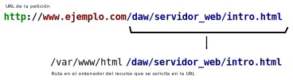

Funcionamiento del servidor web Apache
**************************************
`Apache <https://httpd.apache.org/>`__ es un servidor HTTP de código abierto que puede ser instalado en Linux, Windows y MacOS, entre otros sistemas operativos, aunque lo habitual es tenerlo instalado bajo un sistema operativo Linux.

    Logo de Apache

Dado que en este módulo vamos a usar Apache, os voy a explicar el funcionamiento básico del mismo.

Configuración de Apache
=======================
Toda la configuración de Apache está en un fichero de texto llamado :file:`apache2.conf` dentro del directorio :file:`/etc/apache2`. Cada vez que se hacen cambios en dicho fichero hay que reiniciar el servidor:

.. code-block:: console

    # systemctl restart apache2

Apache implementa la noción de **sitio virtual** (**VirtualHost**) según la normativa `RFC 2616 <https://datatracker.ietf.org/doc/html/rfc2616>`_. Cada sitio se configura en un fichero de texto que se encuentra en el directorio :file:`/etc/apache2/sites-available` donde se indica, como mínimo, **el puerto** al que escuchará y **el directorio** donde están los recursos que puede servir. Un ejemplo mínimo de fichero de configuración de un *VirtualHost* se muestra a continuación:

.. code-block:: linux-config

    <VirtualHost *:80>
        DocumentoRoot /var/www/html
    </VirtualHost>

Directorio de Apache
====================
Cada *VirtualHost* configurado de Apache sirve los recursos que haya en una carpeta que se indica en el fichero de configuración. En el ejemplo anterior, el *VirtualHost* de Apache escuchará las peticiones que lleguen por el puerto 80 y servirá los recursos que hay dentro de la carpeta :file:`/var/www/html`.

Así, siguiendo con nuestro ejemplo e imaginando que el nombre de dominio es **www.ejemplo.com**, si se solicita el recurso :file:`http://www.ejemplo.com/daw/servidor_web/intro.html` entonces Apache servirá el fichero :file:`/var/www/html/daw/servidor_web/intro.html`:

.. important::
    Asegúrate que comprendes la diferencia entre URL y el *path* donde se encuentra el recurso al que apunta la URL.

A continuación te muestro dónde están los recursos de las siguientes URL. En estos ejemplos, el servidor Apache está configurado para servir los recursos dentro de la carpeta :file:`/var/www/html`:

.. csv-table::
    :header: "URL", "Ruta absoluta al recurso en el sistema de archivos del sistema operativo"
    :widths: 1, 1

    ":samp:`http://www.ejemplo.com`", ":file:`/var/www/html/index.html`"
    ":samp:`http://www.ejemplo.com/pagina1.html`", ":file:`/var/www/html/pagina1.html`"
    ":samp:`http://www.ejemplo.com/daw/servidor_web/intro.html`", ":file:`/var/www/html/daw/servidor_web/intro.html`"
    ":samp:`http://www.ejemplo.com/daw/servidor_web/img/portada.png`", ":file:`/var/www/html/daw/servidor_web/img/portada.png`"

