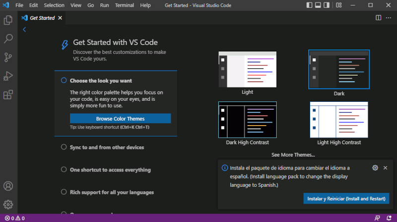
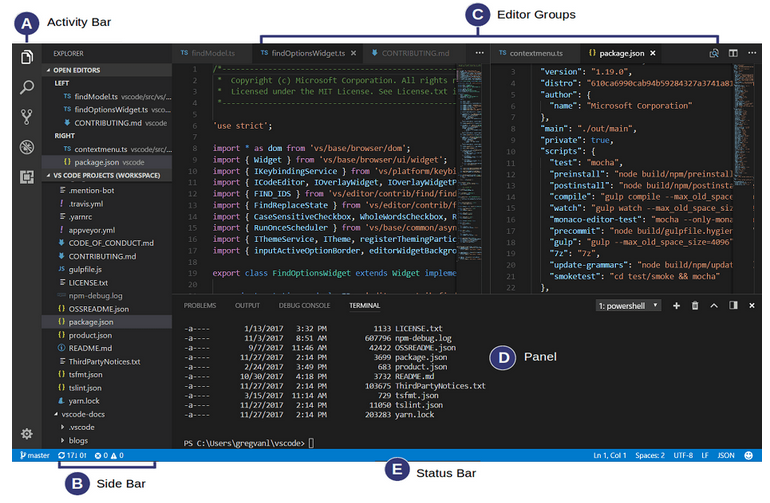
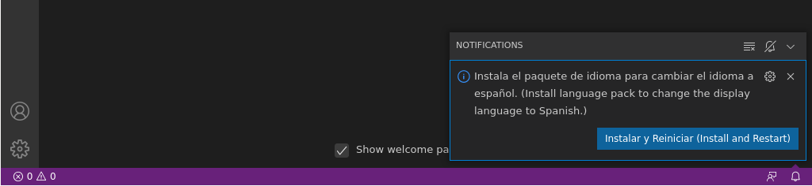
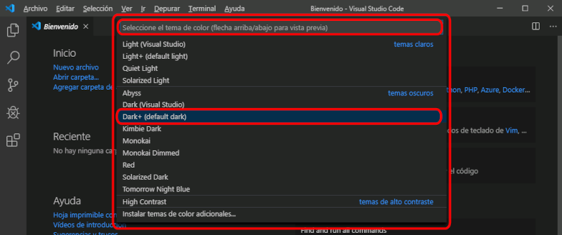
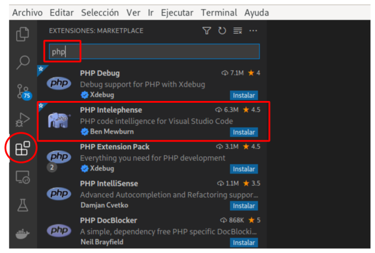
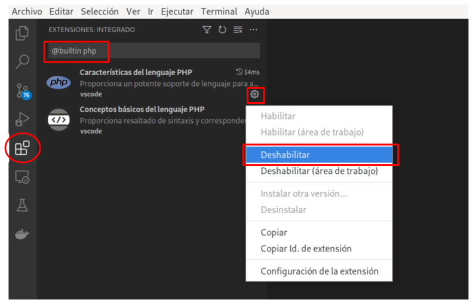
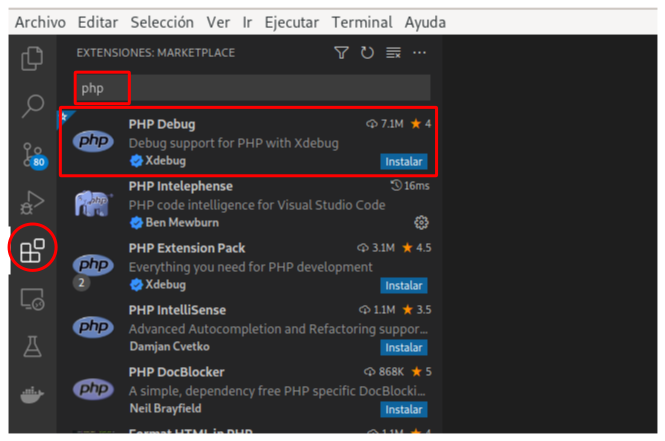

Entorno de desarrollo
#####################
A lo largo de este curso vamos a usar **PHP como lenguaje del lado del servidor** y el editor **Visual Studio Code**, VS Code o simplemente Code para el desarrollo de nuestros programas.

Aunque nosotros vamos a uar Visual Studio Code, hay diferentes editores o IDE para desarrollar programas en PHP como, por ejemplo:

- `PhpStorm <https://www.jetbrains.com/phpstorm/>`__
- `Eclipse <https://www.eclipse.org/pdt/>`__
- `Sublime Text <https://www.sublimetext.com/>`__
- `VS Code <https://code.visualstudio.com/>`__

.. note::
    La diferencia entre un editor o IDE, básicamente, es que el IDE es un entorno de desarrollo que integra varias herramientas como son: el editor, un depurador, botones de acción para ejecutar, lanzar los tests, etc. Un editor tipo Code es más simple porque, en principio, solo consta de eso mismo: un editor. No obstante, en este tipo de editores se pueden añadir funciones a través de extensiones.

En los siguientes apartados te guío para que puedas instalar, preparar y configurar tu entorno de desarrollo para este tema.

.. seealso::

    Si quieres profundizar más en este editor puedes acudir a la documentación oficial: `Documentación de Code <https://code.visualstudio.com/docs>`__.

Lenguaje de programación PHP
============================
PHP, acrónicomo recursivo de *PHP Hypertext Preprocessor*, es un lenguaje de programación de propósito general que se adapta especialmente al desarrollo web.

El código PHP suele ser procesado en un servidor web por un intérprete PHP implementado como un módulo, un *daemon* o como un ejecutable de interfaz común o CGI.

No obstante, en este tema, como introducción al lenguaje y como toma de contacto con él, lo vamos a usar como lenguaje de *scripting* y, por tanto, ejecutaremos los programas que hagamos con el intérprete de PHP instalado en nuestra máquina de desarrollo.

Instalación de PHP
------------------
Si estás en GNU/Linux utiliza tu gestor de paquetes para la instalación de PHP 7.

En Windows tienes que seguir estos pasos si quieres instalar PHP de forma manual:

- Descarga PHP 7 en la `página web de PHP <https://windows.php.net/download#php-7.4>`__. Se trata de un :file:`.zip`.
- Descomprime el fichero :file:`.zip` dentro de :file:`C:/php` (si no existe la carpeta :file:`php` dentro de :file:`C:/` créala).
- Añade al :literal:`PATH` la carpeta :file:`C:/php`.

.. note::
    En temas posteriores usaremos alguna de las distribuciones populares para tener instalado PHP junto a un servidor web y base de datos, como son :literal:`XAMPP` o :literal:`WampServer`. Por ahora, como solo necesitamos PHP, lo dejaremos así.

Visual Studio Code
==================
Visual Studio Code es un editor de programación multiplataforma desarrollado por Microsoft. Es un proyecto de software libre que se distribuye bajo licencia :literal:`MIT`, aunque los ejecutables se distribuyen bajo una licencia gratuita no libre.

.. note::

    El código fuente de este editor se encuentra en `GitHub <https://github.com/Microsoft/vscode>`__.

Este editor no es exclusivo de PHP, se puede usar con una gran cantidad de lenguajes de programación y es altamente extensible como veremos.

Instalación
-----------
Instala Visual Studio Code. Para ello, ves a la `página web oficial de Code <https://code.visualstudio.com>`__ y descarga la versión que necesites en función del Sistema Operativo que uses: Windows, MacOS o Linux.

La primera vez que ejecutes Code se te presenta la siguiente ventana donde lo puedes personalizar de forma guiada.

    Primera ejecución de Code

Interfaz de usuario
-------------------
Como muchos otros editores de código, Code tiene una UI con:

- Un **explorador** a la izquierda donde se muestran los ficheros y carpetas a los que tienes acceso.
- Un **editor** a la derecha donde se muestra, en forma de pestañas, los ficheros que tienes abiertos. Además, este editor permite dividir vertical y horizontalmente estos ficheros que tienes abiertos, pudiendo ver el contenido de varios ficheros al mismo tiempo.
- Una **barra de estado** debajo con información sobre el proyecto abierto y los ficheros que estás editando.

Además, en el caso concreto de Code, en esta UI puedes ver:

- Una **Barra de actividad** que permite cambiar entre vistas como, por ejemplo: explorador, buscar, control de versiones con Git, ejecución y depuración o la vista de extensiones.

    Captura obtenida en la web oficial de Code con las diferentes partes de la UI

Primeros pasos
--------------
Antes de empezar a usar Code para el desarrollo de aplicaciones en PHP es necesario preparar mínimamente este editor.

Code en español
~~~~~~~~~~~~~~~
Code se instala en inglés, pero se puede cambiar al español instalando el paquete de idioma español. De todos modos, si al abrir por primera vez Code detecta que tu sistema operativo está en español te sugerirá que instales el paquete de español. Haz click en instalar y reiniciar y ya lo tendrás.

En otro caso, abre la vista de extensiones, busca la extensión de español e instálala.

.. figure:: ./img/code_ext_es.png
    :width: 40%
    :align: center

Tema y color
~~~~~~~~~~~~
Puedes cambiar el tema eligiendo uno de los temas y colores instalados. Estos temas se dividen en dos: oscuros y claros. También podrías instalar más temas si quieres.

Para cambiar el tema tienes que ir al menú :menuselection:`Archivo --> Preferencias --> Tema de color` o usar la combinación de teclas :kbd:`Ctrl` + :kbd:`K` :kbd:`Ctrl` + :kbd:`T`.

Área de trabajo (Workspace)
===========================
En Visual Studio Code **un proyecto no es más que una carpeta**, así puedes empezar simplemente abriendo una carpeta.

Una vez abierta la carpeta los contenidos de dicha carpeta son mostradas en el explorador. A partir de ahí puedes:

- Crear, eliminar y renombrar ficheros y carpetas.
- Mover ficheros y carpetas arrastrándolas a otros lugares.
- Utilizar el menú contextual para otras opciones.

Preferencias de configuración
=============================
Visual Studio Code organiza las preferencias de configuración en dos niveles:

- **Configuración de usuario**: preferencias que se aplican globalmente, a todos los proyectos que abras.

    Puedes acceder a estas preferencias desde el menú :menuselection:`Archivo --> Preferencias --> Configuración` o usando el atajo :kbd:`Ctrl` + :kbd:`,`.

    .. figure:: ./img/code_settings_ui.png
        :width: 50%
        :align: center

    Esta interfaz en gráfica nos permite configurar Visual Studio Code a nivel global. Desde esta interfaz podemos modificar fácilmente las preferencias globales que se encuentran almacenadas en un fichero JSON llamado :file:`settings.json`.

    Puedes acceder a este fichero y editar las preferencias directamente en él haciendo clic en el botón señalado en la siguiente imagen:

    .. figure:: ./img/code_settings_ui_json.png
        :width: 50%
        :align: center

- **Configuración de áreas de trabajo o workspace**: preferencias que se aplican únicamente al proyecto abierto.

    Las preferencias para un área de trabajo se almacenan en un fichero llamada :file:`settings.json` dentro de una carpeta oculta llamada :file:`.vscode` en la raíz de la carpeta del proyecto.

    Se puede acceder a estas preferencias desde el editor de preferencias en el menú :menuselection:`Archivo --> Preferencias --> Configuración` o usando el atajo :kbd:`Ctrl` + :kbd:`,`. Por último, haz clic en :literal:`Área de trabajo` como se señala en la imagen siguiente:

    .. figure:: ./img/code_settings_ui_ws.png
        :width: 50%
        :align: center

Extensiones para PHP
====================
Al margen de la extensión que ya hemos instalado del lenguaje español, vamos a necesitar otras extensiones para poder usar PHP en Code.

Visual Studio Code reconoce la sintaxis de PHP y tiene soporte básico para este lenguaje, pero para proyectos grandes es insuficiente. Por eso, en los siguientes apartados te recomiendo alguna de las extensiones que te van a permitir aumentar tu productividad y te harán la vida de desarrollador PHP más fácil.

PHP Intelephense
----------------
Abre la actividad de extensiones de Visual Studio Code para instalar esta extensión. Escribiendo :literal:`php` en el buscador de extensiones aparecerá entre las primera posiciones como ves en la imagen siguiente:

`PHP Intelephense <https://intelephense.com/>`__ es una extensión popular para Visual Studio Code que te ofrece características avanzadas como:

- Autocompletado de código.
- Mejor navegación entre componentes.
- Información a través de *tooltips* al pasar el cursor por componentes del código.
- Autoformateado del código fuente.
- Errores en tiempo real basado en el análisis estático del código que escribes.

Una vez instalado esta extensión, es recomendable que desactives el soporte de PHP por defecto en Visual Studio Code. Para desactivarlo, escribe :literal:`@builtin php` en el buscador de extensiones para localizar las extensiones de PHP que vienen incluidas en Visual Studio Code y desactiva la extensión que se llama :literal:`Características del lenguaje PHP` como ves en la captura siguiente:

PHP Debug
---------
Esta extensión nos va a permitir depurar nuestros programas escritos en PHP desde Visual Studio Code.

Abre la actividad de extensiones de Visual Studio Code y busca la extensión que ves en la siguiente captura:

.. important::
    Para poder usar esta extensión, antes tienes que instalar :literal:`XDebug` en tu ordenador. Visita la `página web oficial de XDebug <https://xdebug.org/>`__ y sigue los pasos que ahí se indican para instalarlo en Windows, GNU/Linux o MacOS, según tu caso.
